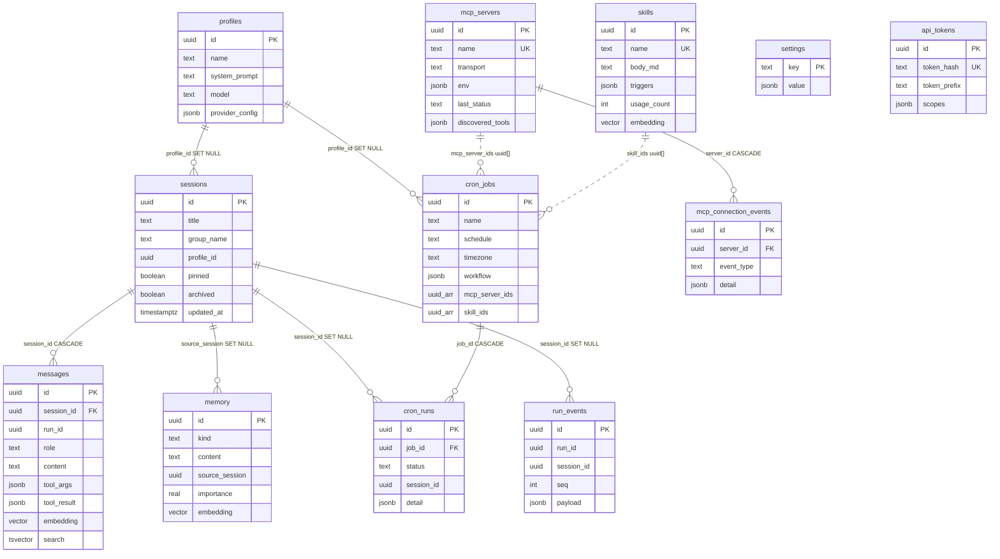

# Open Jarvis — Database Design Reference

Author: Dinesh Reddy Meka

The permanent reference for the Open Jarvis Postgres schema: what exists, why it is
shaped this way, and integrity work status. Companion docs:
`docs/adr/002-postgres-pgvector.md` (why Postgres), `docs/SOURCE-OF-TRUTH.md`,
`docs/DATABASE-DESIGN-ACTION-PLAN.md` (execution plan),
`docs/DATABASE-DESIGN-VERIFICATION.md` (Subagent V audit).

---

## 1. Overview

| Item | Value |
| --- | --- |
| Engine | Postgres **17** (`pgvector/pgvector:0.8.5-pg17`) — PG17 is a hard pin, do not bump |
| Extension | pgvector **0.8.5** (`CREATE EXTENSION vector` in `0001_init.sql`) |
| Host port | **5433** → container 5432 (`docker-compose.yml`) |
| Data dir | `${HERMES_DATA_DIR:-C:/hermes-data}/postgres` (bind mount) |
| DB / user | Compose bootstrap: `hermes` / `hermes` (**superuser**). App runtime should use non-superuser `hermes_app` after `bun run db:create-app-role` (F5) |
| Migrations | Plain SQL in `server/migrations/*.sql`, applied in filename order by `server/src/db/migrate.ts`, tracked in `_hermes_migrations` |
| Drivers | **Bun.sql** (`new SQL(DATABASE_URL, { max: HERMES_DB_POOL_MAX })`) wrapped by **Drizzle** (`drizzle-orm/bun-sql`) |
| Schema mirror | `server/src/db/schema.ts` (Drizzle) — *descriptive only*; the SQL migrations are the source of truth for DDL |

### Connection budget

`max_connections=50` (compose flag). Consumers:

- **Each server process** holds a Bun.sql pool of up to `HERMES_DB_POOL_MAX`
  (default **10**, `server/src/config.ts`). One dev server = 10 slots.
- **Verify/test scripts** (`bun run migrate`, `verify:*`, `bun test` integration
  suites) each create their own pool while running.
- **psql / admin** needs headroom. Because the app connects as the superuser,
  the reserved superuser slots (`superuser_reserved_connections=3`) are consumed
  by app pools too — when the budget is exhausted, *even psql is locked out*
  (`FATAL: sorry, too many clients already`). This happened in practice with
  3 concurrent dev servers + verify runs (5 × 10 = 50).

Rule of thumb: **one** dev server at a time, and keep
`(processes × HERMES_DB_POOL_MAX) ≤ 40`. Prefer `HERMES_DB_POOL_MAX=4`–`5` in
dev once on `hermes_app`. Durable fix: dedicated non-superuser app role (F5 /
`bun run db:create-app-role`).

---

## 1.5 Insert contract (session_id + date + jsonb)

**Locked rules** for every Hermes DB write (shipped in `0009_insert_contract.sql`):

| Rule | Requirement |
| --- | --- |
| **session_id** | Session-scoped operational rows must set `session_id` → `sessions.id`. Global/config rows use **nullable** `session_id` (null when the write is truly global). Prefer nullable on global tables — **do not** invent a bootstrap/system session. |
| **date** | Every insert sets a timestamp: `created_at TIMESTAMPTZ NOT NULL DEFAULT NOW()` (or `started_at` for `cron_runs`). Updates bump `updated_at` where the table has it. |
| **JSON** | Flexible payloads use **`jsonb`** (`run_events.payload`, `settings.value`, `cron_jobs.workflow`, cowork audit fields, etc.). Do not stringify structured data into `text` when jsonb fits. |
| **Reuse first** | Do **not** add a table per feature when `sessions` + `run_events` (or an existing table) already cover it. Extend columns / enforce insert contracts instead. |

Helper: `server/src/db/insert-contract.ts` (`withInsertContract`) — optional, keep repos explicit.

### Per-table insert-contract matrix

| Table | session_id | Nullability | Date columns | JSONB fields | Notes |
| --- | --- | --- | --- | --- | --- |
| `sessions` | *(row is the session)* | n/a | `created_at`, `updated_at` | — | PK `id` is the session identity |
| `messages` | `session_id` | **NOT NULL** | `created_at` | `tool_args`, `tool_result`, `a2ui` | CASCADE delete with session |
| `memory` | `source_session` | nullable | `created_at`, `last_accessed` | — | Historical name for session link; FK SET NULL |
| `run_events` | `session_id` | nullable* | `created_at` | `payload` **NOT NULL** | *Required for cowork audits; prefer set for all agent runs |
| `cron_runs` | `session_id` | nullable | `started_at`, `finished_at` | `detail` | `started_at` is the insert date |
| `jarvis_index_documents` | `session_id` | nullable | `created_at`, `updated_at` | `tags`, `metadata` | FK SET NULL (0009) |
| `jarvis_index_actions` | `session_id` | nullable | `created_at` | `metadata` | FK SET NULL (0009) |
| `jarvis_index_chunks` | via `document_id` | n/a | `created_at` | `metadata` | **Exception** — inherits session from document |
| `jarvis_index_action_links` | via `action_id` | n/a | `created_at` | — | **Exception** — inherits session from action |
| `profiles` | `session_id` | nullable | `created_at`, `updated_at` | `provider_config`, `settings` | Global |
| `settings` | `session_id` | nullable | `created_at`, `updated_at` | `value` **NOT NULL** | Global key/value; upsert bumps `updated_at` |
| `skills` | `session_id` | nullable | `created_at`, `updated_at` | `triggers`, `metadata` | Global library; set when learned in-session |
| `mcp_servers` | `session_id` | nullable | `created_at`, `updated_at` | `env`, `headers`, `discovered_*`, … | Global registry |
| `mcp_connection_events` | `session_id` | nullable | `created_at` | `detail` | Set when connect is session-triggered |
| `cron_jobs` | `session_id` | nullable | `created_at`, `updated_at` | `workflow` | Global definitions |
| `api_tokens` | `session_id` | nullable | `created_at` (+ `last_used`) | `scopes` | Global credentials |
| `index_jobs` | `session_id` | nullable | `created_at`, `updated_at` | `metadata` (schema) | Background or session-triggered |
| `_hermes_migrations` | n/a | n/a | `applied_at` | — | Ledger only |

### Cowork audit event shapes (reuse `sessions` + `run_events`)

No `cowork_tasks` table. One session titled `Cowork: <taskId>`; audit in `run_events` with **session_id + created_at + jsonb payload**.

**`COWORK_STARTED`** (seq 1, written at task **start** via `beginCoworkAudit`):

```json
{
  "taskId": "t-…",
  "goal": "…",
  "deliverableType": "pdf|word|spreadsheet|presentation|other",
  "inputFiles": [{ "sourcePath": "…", "name": "…" }],
  "autoApprove": true
}
```

**`COWORK_FINISHED`** (final seq via `finishCoworkAudit`):

```json
{
  "taskId": "t-…",
  "status": "done|failed|aborted",
  "ok": true,
  "files": ["outbox/t-…/report.pdf"],
  "summary": "…",
  "error": null
}
```

List/detail restore: `restoreCoworkTaskFromEvents` reads these jsonb payloads so `goal` / `deliverableType` survive restart. STARTED without FINISHED (no live process) → `failed` + `"Interrupted by server restart"`. See `docs/COWORK-OFFICE-PLAN.md`.

### Migration note

| Migration | Role |
| --- | --- |
| `0006_integrity_fixes.sql` | FKs, CHECKs, profile/cron timestamps, unique `(run_id, seq)` |
| `0007_skills_sync.sql` | Skills sync columns |
| `0008_jarvis_indexer.sql` | Jarvis recall indexer tables |
| **`0009_insert_contract.sql`** | Nullable `session_id` on global tables; `settings` dates; session FKs |

---

## 2. Schema reference

Application tables (chat + cron + MCP + skills + tokens + Jarvis indexer) plus the
`_hermes_migrations` ledger. All timestamps are `TIMESTAMPTZ` (UTC discipline);
all PKs are `UUID DEFAULT gen_random_uuid()` except `settings.key` (TEXT).
Nullable session links use `ON DELETE SET NULL` FKs (`0006` + `0009`). Dashed
lines to `cron_jobs` arrays remain logical only (elements cannot be FK-enforced;
see F7).



### `sessions` — chat sessions (0001)

| Column | Type | Notes |
| --- | --- | --- |
| `id` | UUID PK | |
| `title` | TEXT NOT NULL | default `'New chat'` |
| `group_name` | TEXT | sidebar grouping |
| `profile_id` | UUID | → `profiles.id`, **no FK yet** (F1) |
| `user_id` | TEXT | reserved for multi-user |
| `pinned`, `archived` | BOOLEAN NOT NULL | defaults false |
| `created_at`, `updated_at` | TIMESTAMPTZ NOT NULL | `updated_at` bumped on every write/touch |

Indexes: `sessions_updated_at_idx (updated_at DESC)`,
`sessions_archived_updated_idx (archived, updated_at DESC)`,
partial `sessions_user_id_idx`, `sessions_profile_id_idx`.
Query shape: list = `ORDER BY pinned DESC, updated_at DESC` with optional
`archived` filter; search = `ILIKE` on title (seq scan, fine at this scale).

### `messages` — chat transcript (0001)

| Column | Type | Notes |
| --- | --- | --- |
| `id` | UUID PK | |
| `session_id` | UUID NOT NULL | FK → `sessions` **ON DELETE CASCADE** |
| `run_id` | UUID | groups one agent run; no FK by design (runs are an event stream) |
| `role` | TEXT NOT NULL | user/assistant/tool/system (no CHECK yet, F6) |
| `content` | TEXT NOT NULL | |
| `tool_name` | TEXT; `tool_args`, `tool_result` | JSONB — shape varies per tool |
| `thinking` | TEXT | reasoning transcript |
| `a2ui` | JSONB | rendered surface payload |
| `tokens` | INT | |
| `embedding` | vector(1536) | populated async by the indexer |
| `search` | TSVECTOR **GENERATED** | `to_tsvector('english', content)` STORED |
| `created_at` | TIMESTAMPTZ NOT NULL | |

Indexes: `messages_session_created_idx (session_id, created_at)` — exactly serves
the keyset-paginated `listBySession` (tie-break on `id`); `messages_search_gin`
GIN on `search`; partial `messages_run_id_idx`; `messages_embedding_hnsw`
(currently **write-only dead weight** — nothing vector-searches messages, F3).

### `memory` — long-term agent memory (0001)

| Column | Type | Notes |
| --- | --- | --- |
| `id` | UUID PK | |
| `kind` | TEXT NOT NULL | fact/preference/etc. |
| `content` | TEXT NOT NULL | |
| `source_session` | UUID | → `sessions.id` — **insert-contract session link** (historical column name; FK SET NULL from `0006`) |
| `user_id` | TEXT | |
| `importance` | REAL NOT NULL | default 0.5 |
| `embedding` | vector(1536) | |
| `created_at`, `last_accessed` | TIMESTAMPTZ | |

Indexes: `memory_embedding_hnsw`, `memory_kind_idx`, partial `memory_user_id_idx`,
`memory_created_at_idx (DESC)`. Query shape: list `ORDER BY importance DESC,
created_at DESC`; retrieval = HNSW cosine `<=>`.

### `skills` — skill library (0001, extended by 0007)

| Column | Type | Notes |
| --- | --- | --- |
| `id` | UUID PK | |
| `name` | TEXT NOT NULL **UNIQUE** | display name |
| `slug` | TEXT NOT NULL **UNIQUE** (0007) | stable sync identity (kebab-case) |
| `description` | TEXT; `body_md` TEXT NOT NULL | full SKILL.md body |
| `source` | TEXT NOT NULL | `builtin` / `user-folder` / `learned` / `git:<url>` |
| `path` | TEXT; partial **UNIQUE** when not null (0007) | on-disk SKILL.md absolute path |
| `content_hash` | TEXT (0007) | SHA-256 of `body_md`; skip re-embed when unchanged |
| `triggers` | JSONB | string array |
| `enabled` | BOOLEAN NOT NULL (0007) | hot filter; agent retrieval skips disabled |
| `last_synced_at` | TIMESTAMPTZ (0007) | last successful disk sync touch |
| `missing_on_disk` | BOOLEAN NOT NULL (0007) | DB row exists but file gone |
| `metadata` | JSONB (0007) | escape hatch only |
| `usage_count`, `success_count` | INT NOT NULL | incremented atomically in SQL |
| `search` | TSVECTOR GENERATED (0007) | name + description + body_md |
| `embedding` | vector(1536) | |
| `created_at`, `updated_at` | TIMESTAMPTZ NOT NULL | |

Indexes: `skills_embedding_hnsw`, `skills_slug_key`, `skills_path_key` (partial),
`skills_search_gin`, `skills_enabled_idx`, `skills_missing_on_disk_idx`,
`skills_source_idx`, `skills_updated_at_idx`. Query shape: list by `updated_at`,
lookup by `slug`/`path`/`name`, FTS `@@ plainto_tsquery`, HNSW retrieval
(`enabled = TRUE`). Sync upserts by path → slug → name; boot +
`POST /api/skills/sync` recreate DB rows for disk-only skills and mark orphans.

### `mcp_servers` — MCP connection registry (0001, extended by 0004)

The reference example of the **typed columns + JSONB** pattern: everything the
UI filters or sorts on is a real column; everything that is a cache or a
flexible bag is JSONB.

| Column | Type | Notes |
| --- | --- | --- |
| `id` | UUID PK; `name` TEXT NOT NULL **UNIQUE** | |
| `description` | TEXT (0004) | |
| `transport` | TEXT NOT NULL | stdio/http (no CHECK yet, F6) |
| `command`, `url` | TEXT | one per transport kind |
| `env`, `headers` | JSONB | free-form key/value |
| `enabled` | BOOLEAN NOT NULL | |
| `tool_whitelist` | JSONB | string array |
| `http_prefer_sse` | BOOLEAN NOT NULL (0004) | |
| `timeout_ms` | INTEGER (0004) | |
| `auto_reconnect` | BOOLEAN NOT NULL (0004) | |
| `last_status`, `last_error` | TEXT (0004) | hot filter → real columns |
| `last_connected_at`, `last_tested_at` | TIMESTAMPTZ (0004) | |
| `discovered_tools/_resources/_prompts` | JSONB (0004) | discovery **cache**, read whole |
| `metadata` | JSONB (0004) | escape hatch |
| `created_at`, `updated_at` | TIMESTAMPTZ NOT NULL | |

Indexes: `idx_mcp_servers_enabled`, `idx_mcp_servers_last_status`,
`idx_mcp_servers_updated_at (DESC)`.

### `mcp_connection_events` — connect/disconnect audit trail (0004)

`id` UUID PK · `server_id` UUID NOT NULL FK → `mcp_servers` **ON DELETE CASCADE** ·
`event_type` TEXT NOT NULL · `status` TEXT · `transport_kind` TEXT ·
`detail` JSONB · `created_at` TIMESTAMPTZ NOT NULL.
Index: `idx_mcp_connection_events_server_created (server_id, created_at DESC)` —
matches the only read (`listEvents` per server, newest first). Unbounded growth;
prune candidate (F4).

### `cron_jobs` — scheduled prompts (0001, extended by 0005)

| Column | Type | Notes |
| --- | --- | --- |
| `id` | UUID PK; `name` TEXT NOT NULL | no unique on name yet (F6) |
| `schedule` | TEXT NOT NULL | cron expression |
| `prompt` | TEXT NOT NULL | |
| `profile_id` | UUID | → `profiles.id`, **no FK yet** (F1) |
| `enabled` | BOOLEAN NOT NULL | |
| `last_run`, `next_run` | TIMESTAMPTZ | scheduler state |
| `timezone` | TEXT NOT NULL (0005) | default `'UTC'` |
| `workflow` | JSONB NOT NULL (0005) | wizard answers + bindings, zod-validated at REST |
| `mcp_server_ids` | UUID[] NOT NULL (0005) | denormalized from `workflow`, GIN-indexed |
| `skill_ids` | UUID[] NOT NULL (0005) | denormalized from `workflow`, GIN-indexed |
| `updated_at` | TIMESTAMPTZ NOT NULL (0005) | |

Indexes: `cron_jobs_enabled_next_run_idx`, partial
`cron_jobs_next_run_idx WHERE enabled` (scheduler tick),
`cron_jobs_mcp_server_ids_gin`, `cron_jobs_skill_ids_gin` (serve the
`@>` containment filters in `cronRepo.listJobs`).
Note: array elements have no referential integrity — deleting an MCP server or
skill leaves stale UUIDs in bindings (cleanup on delete, F7).

### `cron_runs` — per-execution history (0001, extended by 0005)

`id` UUID PK · `job_id` UUID NOT NULL FK → `cron_jobs` **ON DELETE CASCADE** ·
`started_at` TIMESTAMPTZ NOT NULL · `finished_at` TIMESTAMPTZ ·
`status` TEXT NOT NULL default `'running'` · `session_id` UUID FK → `sessions`
**ON DELETE SET NULL** (`0006`) · `error` TEXT · `detail` JSONB (0005 — per-run
binding snapshot: `{ mcpAllowed, skillsForced, attempts, errorCode }`).
Index: `cron_runs_job_started_idx (job_id, started_at DESC)`.

### `run_events` — agent-run event log (0001)

`id` UUID PK · `run_id` UUID NOT NULL (no FK — the run *is* this stream) ·
`session_id` UUID FK → `sessions` **ON DELETE SET NULL** (`0006`) · `seq` INT NOT NULL ·
`event_type` TEXT NOT NULL · `payload` JSONB NOT NULL ·
`created_at` TIMESTAMPTZ NOT NULL.
Indexes: unique `run_events_run_seq_key (run_id, seq)` (`0006`),
`run_events_created_at_idx (DESC)`, partial
`run_events_session_id_idx (session_id, created_at)`.

### `profiles` — agent personas (0001, timestamps 0006, session_id 0009)

`id` UUID PK · `name` TEXT NOT NULL (no unique, F6 deferred) · `system_prompt` TEXT NOT NULL ·
`model` TEXT NOT NULL · `temperature` REAL NOT NULL · `provider` TEXT NOT NULL ·
`provider_config` JSONB · `settings` JSONB · `session_id` UUID nullable (global) ·
`created_at` / `updated_at` TIMESTAMPTZ NOT NULL. A `Default` profile is seeded by
0001 (guarded by `WHERE NOT EXISTS`).

### `settings` — app key/value store (0001, dates + session_id 0009)

`key` TEXT PK · `value` JSONB NOT NULL · `session_id` UUID nullable ·
`created_at` / `updated_at` TIMESTAMPTZ NOT NULL. Upsert via
`ON CONFLICT (key) DO UPDATE` (bumps `updated_at`). The one table where
"everything JSONB" for the value is exactly right: opaque payloads, read whole
by key, never filtered by content.

### `api_tokens` — hashed programmatic tokens (0003, session_id 0009)

`id` UUID PK · `user_id` TEXT · `name` TEXT NOT NULL ·
`token_hash` TEXT NOT NULL **UNIQUE** (sha256; raw token shown once) ·
`token_prefix` TEXT NOT NULL (display) · `scopes` JSONB NOT NULL default `[]` ·
`session_id` UUID nullable · `last_used` TIMESTAMPTZ · `created_at` TIMESTAMPTZ NOT NULL.

### `_hermes_migrations` — migration ledger

`id` SERIAL PK · `name` TEXT NOT NULL UNIQUE · `applied_at` TIMESTAMPTZ.
Files apply in lexicographic filename order; every statement in
`0001`–`0005` is `IF NOT EXISTS`-guarded, so re-runs are safe.

---

## 3. Design principles actually in use

1. **Typed columns for hot paths, JSONB for flexible payloads** (the 0004
   pattern). Anything that appears in a `WHERE`, `ORDER BY`, or `JOIN` gets a
   real column with a real index (`enabled`, `last_status`, `next_run`,
   `updated_at`). Anything that is written and read as an opaque blob stays
   JSONB (`workflow`, `discovered_tools`, `detail`, `provider_config`).
2. **Denormalized `uuid[]` + GIN for many-to-many filters** (the 0005 pattern).
   `cron_jobs.mcp_server_ids`/`skill_ids` are copied out of `workflow` on every
   write so "jobs using MCP X" is a one-hop GIN array containment scan instead
   of a JSON path scan. The write side keeps arrays in sync in the repository
   (`cronRepo.createJob`/`updateJob`).
3. **Generated `tsvector` + GIN for full-text search.** `messages.search` is a
   STORED generated column — it can never drift from `content`, costs nothing at
   query time, and `plainto_tsquery` hits the GIN index.
4. **HNSW (cosine) for vector retrieval.** `vector(1536)` columns on
   `messages`/`memory`/`skills` with `hnsw (embedding vector_cosine_ops)
   WITH (m=16, ef_construction=64)` — pgvector defaults, appropriate below
   ~100k rows. Queries use the `<=>` cosine-distance operator, which matches the
   opclass. Embeddings are populated asynchronously (`vector/indexer.ts`), so
   inserts never block on the embedding provider.
5. **`TIMESTAMPTZ` everywhere; ISO-8601 at the API boundary.** Repositories
   convert with `.toISOString()`; the DB never stores naive timestamps.
6. **Cascade only where the child is meaningless without the parent**
   (`messages`, `cron_runs`, `mcp_connection_events`); nullable references
   elsewhere — which then *should* be `ON DELETE SET NULL` FKs (F1).

**When to use JSONB vs a real column** — decision table:

| Ask | Real column | JSONB |
| --- | --- | --- |
| Do queries filter/sort/join on it? | ✅ always | ❌ never (or add a denormalized column) |
| Does it need FK / CHECK / NOT NULL per field? | ✅ | ❌ impossible inside JSONB |
| Is the shape stable and known? | ✅ | shape varies per row / version |
| Is it read whole and passed through? | overkill | ✅ ideal |
| Is it a cache that can be regenerated? | overkill | ✅ ideal |

---

## 4. Why not everything JSONB

A recurring question: the app is document-ish, so why not `id + blob` tables?
Concrete costs for *this* app:

- **No referential integrity.** A `sessionId` inside a JSONB blob cannot be a
  foreign key. Deleting a session could never cascade to its messages —
  today's `messages.session_id UUID REFERENCES sessions ON DELETE CASCADE` is
  what keeps transcript cleanup a one-statement operation.
- **No type or nullability checking.** `"enabled": "yes"`, a missing
  `next_run`, or a misspelled key are all valid JSONB. The cron scheduler tick
  (`WHERE enabled AND next_run <= now()`) only works reliably because those are
  typed columns the planner and the DB constraint system understand.
- **Row size and TOAST.** JSONB stores keys per row and de-TOASTs the *entire*
  blob to read one field. `mcp_servers.discovered_tools` can be tens of KB; if
  `enabled` lived in the same blob, every enabled-check would pay full
  de-TOAST + parse. As typed columns, those checks touch a few bytes.
- **Weak planner statistics.** Postgres keeps rich per-column stats
  (histograms, n_distinct) for real columns but almost nothing for arbitrary
  JSON paths. Sorts, join orders, and row estimates degrade — the planner
  guesses, and misestimates compound in multi-table queries.
- **Every hot filter needs an expression index.** With JSONB you index
  `(workflow->>'enabled')` one path at a time, each one write overhead, and
  `jsonb_path_ops` GIN only accelerates containment (`@>`) — not range scans
  (`next_run <= now()`), not `ORDER BY`, not inequality.

### Worked example: array column vs JSONB path

"Which cron jobs are bound to MCP server `$1`?" — both shapes exist in
`cron_jobs` (the array is denormalized from `workflow`):

```sql
-- A: typed uuid[] column + GIN (what cronRepo.listJobs does)
SELECT * FROM cron_jobs WHERE mcp_server_ids @> ARRAY[$1]::uuid[];

-- B: JSONB path (what we deliberately avoid)
SELECT * FROM cron_jobs WHERE workflow->'mcpServerIds' ? $1;
```

Expected plans:

```text
-- A: with cron_jobs_mcp_server_ids_gin
Bitmap Heap Scan on cron_jobs
  Recheck Cond: (mcp_server_ids @> $1)
  -> Bitmap Index Scan on cron_jobs_mcp_server_ids_gin
       Index Cond: (mcp_server_ids @> $1)

-- B: no index on that path exists
Seq Scan on cron_jobs
  Filter: ((workflow -> 'mcpServerIds') ? $1)
```

B *can* be indexed (`GIN ((workflow->'mcpServerIds') jsonb_path_ops)` plus a
rewrite to `@> to_jsonb($1)`), but you then maintain one expression index per
queried path, compare **text** UUIDs (~2× the key size of binary `uuid`),
and still get worse row estimates. The denormalized array costs one copy on
write and keeps reads uniformly cheap — that trade is the 0005 design.

**Where JSONB is the right call here:** `cron_jobs.workflow` (wizard answers —
shape evolves with the UI, zod-validated at the REST boundary, read whole),
`mcp_servers.discovered_*` (regenerable caches), `cron_runs.detail` /
`run_events.payload` (per-run snapshots, append-only, never filtered by
content), `profiles.provider_config`, `settings.value`.

---

## 5. Action plan status

Severity-ranked from the schema audit. Implementation status verified in
`docs/DATABASE-DESIGN-VERIFICATION.md` (2026-07-11 for F1–F7). Companion
execution plan: `docs/DATABASE-DESIGN-ACTION-PLAN.md`.

| Item | Status |
| --- | --- |
| F1 nullable FKs | **Completed** (`0006`) |
| F2 migration runner hardening | **Completed** (`splitPostgresStatements` + `sql.begin`) |
| F3 drop `messages_embedding_hnsw` | **Deferred** (index kept for planned message vector search) |
| F4 unique `(run_id, seq)` + retention | **Completed** (`run_events_run_seq_key` + prune script/env) |
| F5 `hermes_app` role | **Completed (scripted)** — operator must run `db:create-app-role`; not auto-deployed |
| F6 constraint hygiene | **Partial** — CHECKs, timestamps, drop duplicate hash index **done**; name UNIQUEs **deferred** |
| F7 cron binding cleanup | **Completed** (repo helpers on MCP/skill delete) |
| **F8 insert contract** | **Completed** (`0009_insert_contract.sql` — session_id + dates on all tables; jsonb payloads; cowork restore) |

### F8 — Insert contract: session_id + date + jsonb (2026-07-12) — COMPLETED

Every insert carries a date; session-scoped rows carry `session_id`; global tables
get nullable `session_id`; structured payloads stay `jsonb`. See §1.5.

Shipped:

- Migration `0009_insert_contract.sql`
- Drizzle mirror + `settingsRepo` timestamp upsert
- `beginCoworkAudit` / `finishCoworkAudit` / `restoreCoworkTaskFromEvents`
- Tests: `server/test/insert-contract.test.ts`, `cowork-restore.test.ts`,
  extended `cowork-db.integration.test.ts` / `db.integration.test.ts`

### F1 — Add missing foreign keys (HIGH) — COMPLETED

Orphan risk before `0006`: deleting a profile or session stranded dangling UUIDs
in five places. All are nullable references → `ON DELETE SET NULL`.

```sql
-- Optional pre-clean if orphans already exist:
-- UPDATE sessions s SET profile_id = NULL
--   WHERE profile_id IS NOT NULL
--     AND NOT EXISTS (SELECT 1 FROM profiles p WHERE p.id = s.profile_id);

ALTER TABLE sessions  ADD CONSTRAINT sessions_profile_fk
  FOREIGN KEY (profile_id) REFERENCES profiles(id) ON DELETE SET NULL;
ALTER TABLE cron_jobs ADD CONSTRAINT cron_jobs_profile_fk
  FOREIGN KEY (profile_id) REFERENCES profiles(id) ON DELETE SET NULL;
ALTER TABLE memory    ADD CONSTRAINT memory_source_session_fk
  FOREIGN KEY (source_session) REFERENCES sessions(id) ON DELETE SET NULL;
ALTER TABLE cron_runs ADD CONSTRAINT cron_runs_session_fk
  FOREIGN KEY (session_id) REFERENCES sessions(id) ON DELETE SET NULL;
ALTER TABLE run_events ADD CONSTRAINT run_events_session_fk
  FOREIGN KEY (session_id) REFERENCES sessions(id) ON DELETE SET NULL;
```

(`messages.run_id` intentionally stays FK-less — runs are an event stream, not
a table.)

### F2 — Harden the migration runner (HIGH, code not SQL) — COMPLETED

`server/src/db/migrate.ts` now uses `splitPostgresStatements` (aware of quotes,
dollar quotes, and comments) and applies each migration file inside
`sql.begin()` with the `_hermes_migrations` ledger insert in the same
transaction. Covered by `server/test/migrate.test.ts`.

### F3 — Drop the dead HNSW index on messages (MEDIUM) — DEFERRED

Every assistant message may be embedded and `messages_embedding_hnsw` is
maintained on write, but current search uses FTS for messages and vectors for
memory/skills. **Decision for `0006`:** keep the index until product confirms
message vector search is out of scope. Sketch if dropping later:

```sql
DROP INDEX IF EXISTS messages_embedding_hnsw;
-- Recreate (from 0001) when message vector search is implemented:
-- CREATE INDEX messages_embedding_hnsw ON messages
--   USING hnsw (embedding vector_cosine_ops) WITH (m = 16, ef_construction = 64);
```

Optionally also stop queueing message embeddings in `agent/runtime.ts`.

### F4 — Event-log integrity and retention (MEDIUM) — COMPLETED

```sql
-- Shipped in 0006:
DROP INDEX IF EXISTS run_events_run_seq_idx;
CREATE UNIQUE INDEX run_events_run_seq_key ON run_events (run_id, seq);
```

Retention: `runEventsRepo.pruneOlderThan` /
`mcpServersRepo.pruneConnectionEventsOlderThan`, script
`bun run db:prune-events`, env `HERMES_EVENT_RETENTION_DAYS` /
`HERMES_MCP_EVENT_RETENTION_DAYS` (default 30).

### F5 — Dedicated non-superuser app role (MEDIUM — scripted, operator-applied)

Keeps `superuser_reserved_connections` slots free for admin access even when
the app exhausts its pool (bitten in practice — 50/50 slots consumed left
`psql` locked out).

**Status:** Documented and scripted — not auto-deployed. Compose still boots
the `hermes` superuser; operators must set a password and run the bootstrap
script before switching the app URL.

- Script: `scripts/db-create-app-role.ts` (`bun run db:create-app-role`)
- Env: `.env.example` — `DATABASE_URL` (app → `hermes_app`), `DATABASE_ADMIN_URL`
  (migrations/admin), `HERMES_APP_PASSWORD`
- Compose note: `docker-compose.yml` documents that `POSTGRES_USER=hermes` is
  the bootstrap superuser only

Operator steps:

1. `bun run db:up` and `bun run migrate` (as `hermes` / `DATABASE_ADMIN_URL`)
2. Set `HERMES_APP_PASSWORD` and run `bun run db:create-app-role`
3. Point app `DATABASE_URL` at `hermes_app`; keep `DATABASE_ADMIN_URL` for migrate
4. Optionally set `HERMES_DB_POOL_MAX=4` or `5` in local `.env`

Until step 2–3 are done in an environment, that environment is still on the
bootstrap superuser.

### F6 — Constraint hygiene (LOW) — PARTIAL (see table above)

Shipped in `0006`:

```sql
DROP INDEX IF EXISTS api_tokens_hash_idx;

ALTER TABLE messages   ADD CONSTRAINT messages_role_check
  CHECK (role IN ('user','assistant','system','tool'));
ALTER TABLE cron_runs  ADD CONSTRAINT cron_runs_status_check
  CHECK (status IN ('running','completed','failed'));
ALTER TABLE mcp_servers ADD CONSTRAINT mcp_servers_transport_check
  CHECK (transport IN ('stdio','http'));

ALTER TABLE cron_jobs ADD COLUMN IF NOT EXISTS created_at TIMESTAMPTZ NOT NULL DEFAULT NOW();
ALTER TABLE profiles
  ADD COLUMN IF NOT EXISTS created_at TIMESTAMPTZ NOT NULL DEFAULT NOW(),
  ADD COLUMN IF NOT EXISTS updated_at TIMESTAMPTZ NOT NULL DEFAULT NOW();
```

**Deferred to `0007` (or later):** unique names (need duplicate cleanup / UX confirmation):

```sql
ALTER TABLE cron_jobs ADD CONSTRAINT cron_jobs_name_key UNIQUE (name);
ALTER TABLE profiles  ADD CONSTRAINT profiles_name_key UNIQUE (name);
```

### F7 — Stale binding cleanup for 0005 arrays (LOW, code) — COMPLETED

`uuid[]` elements cannot be FK-enforced. On MCP server / skill delete,
`cronRepo.removeDeletedMcpServerBinding` /
`removeDeletedSkillBinding` strip typed arrays and matching `workflow` JSON
ids (called from `mcp_servers` / `skills` delete).

### Deferred / watch list

- F3: optionally drop `messages_embedding_hnsw` if message vector search is cancelled.
- F6 leftover: `profiles.name` / `cron_jobs.name` UNIQUE (`0007`).
- F5 leftover: point live `DATABASE_URL` at `hermes_app` per environment.
- `sessions_archived_updated_idx` doesn't include `pinned`, so the
  `pinned DESC, updated_at DESC` sort isn't fully index-served — irrelevant at
  desktop scale, revisit if session counts grow.
- `ILIKE '%q%'` searches on `sessions.title` / `skills.name` — add `pg_trgm`
  GIN indexes only if they get slow.
- Auth (`better-auth`) currently has no database adapter — users/sessions are
  in-memory. Fine under localhost bypass; must move into Postgres before
  multi-user.
- `cronRepo.listJobs` sorts by `name` **descending** — looks like a typo for
  ascending.

---

## 6. Legacy Hermes Agent data (verified)

The legacy agent's SQLite store at `%LOCALAPPDATA%\hermes\state.db`
(schema_version 17) was opened read-only and enumerated in full: `sessions` 0
rows, `messages` 0 rows, all FTS5 shadow tables empty, `state_meta` empty. The
legacy `sessions/`, `memories/`, and `cron/` folders are likewise empty of real
data. **No database import is needed — there is nothing to import.**

The only legacy data of value is **72 `SKILL.md` files** (448 files, ~5.8 MB
with assets) in `%LOCALAPPDATA%\hermes\skills`. No import script is required:
set `SKILLS_DIR=C:/Users/dines/AppData/Local/hermes/skills` in `.env` (or copy
the folder to `./skills`, the default) and `syncSkillsFromDisk` (boot +
`POST /api/skills/sync`) will parse frontmatter, upsert by `path`/`slug`/`name`,
set `content_hash`, and queue embeddings when content changes. Optional manual
carry-overs: the legacy `SOUL.md` persona into the Default profile's
`system_prompt`, and a review of the legacy `config.yaml` for provider settings
worth adding to the `settings` table.
